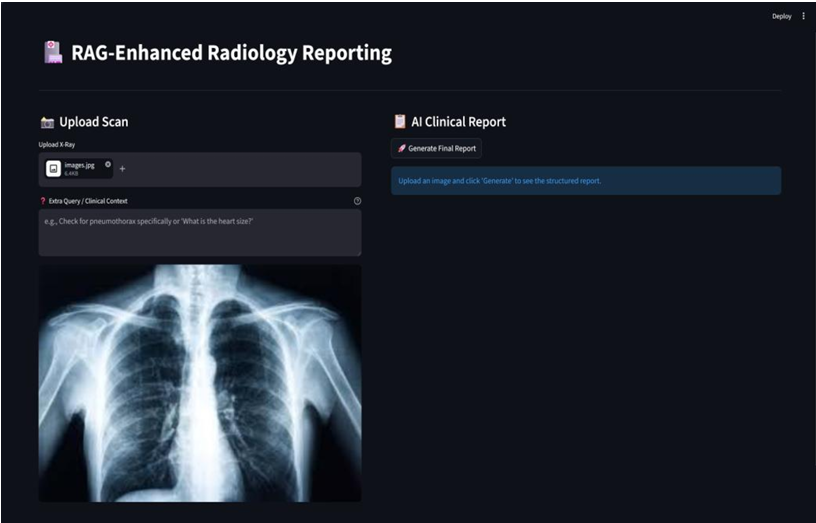
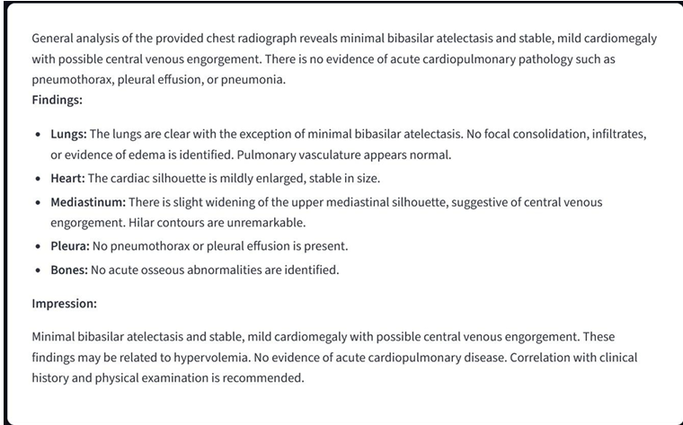

# Rad-RAG: AI-Powered Pneumonia Detection & Radiology Report Generation

## Overview
Rad-RAG is a Retrieval-Augmented Generation (RAG) based medical AI framework designed for automated pneumonia detection and clinical radiology report generation from chest X-ray images.

The system combines computer vision, semantic retrieval, and large language models to generate structured radiology reports with improved clinical fidelity.

This project integrates:
- DenseNet-121 for pathology detection
- FAISS vector search for retrieval
- SentenceTransformers for semantic embeddings
- Gemma 3 for multimodal clinical report generation
- Streamlit for deployment and real-time interaction

---

## Features
- Chest X-ray pathology detection
- Retrieval-Augmented Generation (RAG)
- Automated radiology report generation
- Clinical context aware prompting
- Professional report formatting
- FAISS-based semantic search
- Streamlit web interface
- Evaluation using F1-CheXbert metrics

---

## Tech Stack
- Python
- PyTorch
- TorchXRayVision
- Streamlit
- FAISS
- SentenceTransformers
- Google Generative AI (Gemma 3)
- NumPy
- Scikit-learn

---

## Project Architecture
1. Chest X-ray upload
2. DenseNet-121 extracts pathology findings
3. Findings converted into semantic embeddings
4. FAISS retrieves relevant clinical reports
5. Gemma 3 generates final structured radiology report
6. Streamlit displays downloadable report

---

## Dataset
This project utilizes:
- MIMIC-CXR Dataset
- Chest X-ray image datasets for pathology benchmarking

---

## Output Screenshots

### Home Interface


### Generated Clinical Report


---

## Evaluation Metrics
- Clinical Fidelity
- F1 Score
- Precision
- Recall
- AUC

---

## Installation

Clone the repository:

```bash
git clone https://github.com/your-username/pneumonia_detection.git
cd pneumonia_detection
```

Install dependencies:

```bash
pip install -r requirements.txt
```

Run the Streamlit app:

```bash
streamlit run app.py
```

---

## Example Usage
1. Upload a chest X-ray image
2. Add optional clinical query
3. Generate AI-assisted radiology report
4. Download the generated report

---

## Research Objective
The objective of this project is to bridge the gap between AI-based pathology detection and human-readable radiology reporting using Retrieval-Augmented Generation.

---

## Key Technologies Used
- DenseNet-121
- FAISS Vector Database
- SentenceTransformers
- Streamlit
- Gemma 3
- PyTorch
- Retrieval-Augmented Generation (RAG)

---

## Contributors
This project was developed collaboratively as part of a team-based academic research project focused on AI-assisted radiology report generation.

### My Contributions
- Streamlit interface integration
- RAG pipeline integration
- Report generation workflow
- Testing and evaluation

---

## Disclaimer
This project is developed for educational and research purposes only. It should not be used for real-world clinical diagnosis or medical decision-making.

---

## Future Improvements
- Multi-disease detection
- Improved report explainability
- Real-time hospital integration
- PACS compatibility
- Fine-tuned medical LLM deployment

---

## License
This project is intended for academic and educational use.
